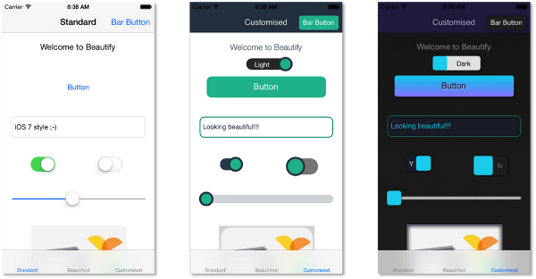

# Welcome to the beautify beta

So glad you could join us ...

If you have reached this page, you are lucky enough to have been granted access to the beta version of beautify for iOS. We have been hard at work creating what we think is a pretty awesome tool for creating beautiful apps. But before we add too many whistles and bells we'd like to share it with you and see what you think.

This page contains some (brief) instructions that will get you up and running with beautify. If you get stuck or find and bugs, please give us a shout. - <a href="mailto:feedback@beautify.io">feedback@beautify.io</a>

Finally, I'd like to ask you a favor. What we need more than anything else is your thoughts, ideas and feelings. We'd love it if you could help us make beautify even better.

From bland to beautiful.

-- Colin E. [@ColinEberhardt](https://twitter.com/ColinEberhardt), and the beautify team, [@Beautifyio](https://twitter.com/Beautifyio).

# Quick Start

Beautify is composed of two separate components:

1. The iOS frameworks which enhance the rendering capabilities of UIKit controls.
2. A web-based service which allows you to live-style your beautified app.

In order to get you up-and-running as quickly as possible, we have created a simple calculator app for you to download. This Xcode project contains all of the required frameworks so that you can simply build and run.

Download the following, unzip and open it within Xcode:

+ [BeautifyCalculator-1.0.1.zip](https://s3-eu-west-1.amazonaws.com/beautify/BeautifyCalculator-1.0.1.zip)

This project is a very simple, single view controller calculator. If you open **AppDelegate.m** you will see the following:
	
	- (BOOL)application:(UIApplication *)application didFinishLaunchingWithOptions:(NSDictionary *)launchOptions
	{
	    // activate beautify - this enhances the capabilities of the UIKit controls
	    [[BYBeautify instance] activate];
	    
	    // connect to a live design session
	    [[BYBeautifyStreamer instance] initiateDesignSessionWithUsername:@"YOUR_USER_NAME"];
	    
	    return YES;
	}

This is all that is required to enabled beautify and connect to the web-based designer. The beautify framework, that enhances the UIKit controls, is open source and [available on GitHub](https://github.com/beautify/beautify-ios). At this point, you could play around with the new API methods that beautify adds to your controls (see the GitHub project for documentation), however, live-styling your application is much more fun ...

You should have received details of how to sign-up for the web-based designer in your welcome email. Go ahead and do that now, and also update the code shown above replacing **YOUR_USER_NAME** with the name you used to sign up.

The web-based designer at [designer.beautify.io](http://designer.beautify.io/) creates a live connection to your device (or multiple devices) allowing you to apply one of a number of default themes, or create your own. 

For a quick introduction to the whole process, see the video below:

<iframe width="480" height="360" src="//www.youtube.com/embed/PDX9aaw4y48" frameborder="0"> </iframe>  

If you want to know how to use beautify in your own app, or how to use it in an app you submit to the App Store, then read on!

# Enabling beautify within your own app

## Obtain the iOS frameworks

The first step is to obtain a copy of the beautify iOS code. There are two separate frameworks that you need in order to run a live design sessions. These are:

+ **Beautify** - this framework enhances the capabilities of the UIKit controls, adding shadows, gradients, borders and much more. It is open source and hosted on [GitHub](https://github.com/beautify/beautify-ios).
+ **BeautifyStreaming** - this framework connects your app to a live design session.

Both frameworks are available to download below:

+ [Beautify-1.0.1.zip](https://s3-eu-west-1.amazonaws.com/beautify/Beautify-1.0.1.zip)
+ [BeautifyStreaming-1.0.1.zip](https://s3-eu-west-1.amazonaws.com/beautify/BeautifyStreaming-1.0.1.zip)

## Add the required frameworks to your app

In order to use beautify you need to add the framework to your project:

 + Copy the **Beautify.framework** into the *Frameworks* group in your project 

Beautify also depends on the following frameworks which you must also add to your application:  

 + **CFNetwork.framework** †
 + **Security.framework** †
 + **libicucore.dylib** †
 + **QuartzCore.framework**

Please note, the frameworks marked with a dagger (†) are not required for release builds of your app.

## Activate beautify

Within **AppDelegate.m** import the framework header:

    #import <Beautify/Beautify.h>

Then within the existing `application:didFinishLaunchingWithOptions:` method add the following:

    [[BYBeautify instance] activate];

With beautify activated, all the UIKit controls within your application are enhanced. You can gain access to the extra styling properties and methods via the `renderer` property that is added to each control. For full details of the programmatic beautify APIs, see the [beautify-ios GitHub pages](https://github.com/beautify/beautify-ios). 

## Starting a live design session

A faster and more convenient way of styling your application is to connect to a live design session. When you were invited to the beautify beta you will have received details of how to sign up. Do this now!

If you have already signed up visit [designer.beautify.io](http://designer.beautify.io/) and login to your personal design session.

## Connect your device

In order to live-style your app you need to make a connection to the web-based beautify designer. To do this, you will need to add the **BeautifyStreaming** framework to your project:

 + Copy the **BeautifyStreaming.framework** into the *Frameworks* group in your project

To make a connection, import the following header:

    #import <BeautifyStreaming/BeautifyStreaming.h>

Then update `application:didFinishLaunchingWithOptions:` as follows: 

    // enhance the UI controls
    [[BYBeautify instance] activate];
    
    // connect to a streaming server
    [[BYBeautifyStreamer instance] initiateDesignSessionWithUsername:@"YourUserNameHere"];

Using your own username of course!

The beautify streamer creates a socket connection to the web-based beautify designer. Any changes made via the web-based designer should be reflected immediately on your device. You can even connect multiple devices to a single session!

## Make it beautiful

Once you have logged in to the designer and started your device with the beautify streamer code above you should now be in a position to live-style your app. Go ahead ... have fun ... go crazy!

# Releasing your app

Have you finished playing with the designer? ... yes? ... good. It's now time to create a release build of your application.

From the web-based designer hit the export button, then copy / paste the JSON into a file. Place this file within your application, giving it a suitable name. **BeautifyRocks.json** will do.  

For the release build there are just two framework dependencies:

 + **Beautify.framework** 
 + **QuartzCore.framework**

Within the `application:didFinishLaunchingWithOptions:` method you just need to activate and load your designs as follows:

    [[BYBeautify instance] activateWithStyle:@"BeautifyRocks"];

And that's it!

Wow - that really was simple wasn't it? 

Thoughts, bugs, ideas, money and other offers - give us a shout -  <a href="mailto:enquiries@beautify.io">enquiries@beautify.io</a>

# Release Notes

The following is a few notes regarding the current beautify for iOS framework that might help you in your development:

 + We currently beautify the following controls: `UITextField`, `UIButton`, `UILabel`, `UINavigationBar`, `UITableViewCell`, `UISwitch`, `UIViewController`, `UIImageView` and `UIBarButtonItem` - there will be more to follow ...
 + We have added a highlighted state to `UITextField` which indicates when a text field is being edited. We think this is pretty cool!
 

